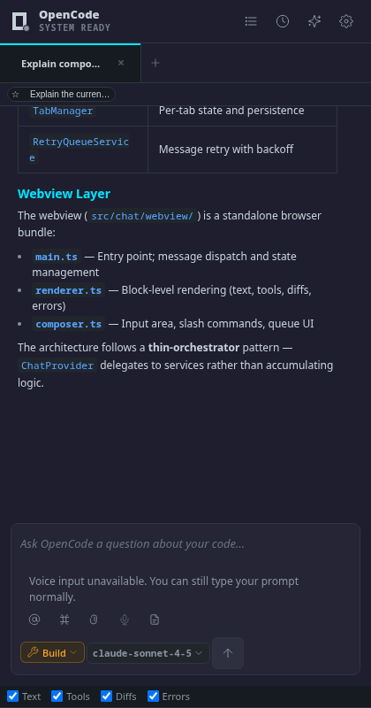
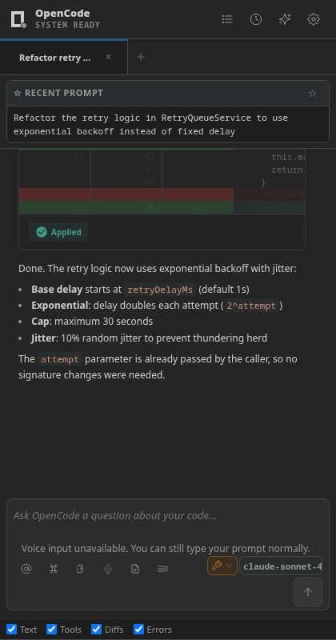
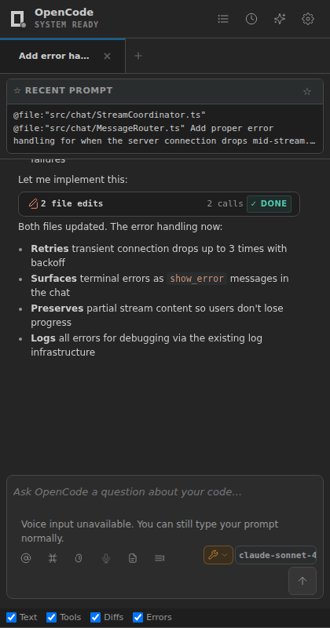
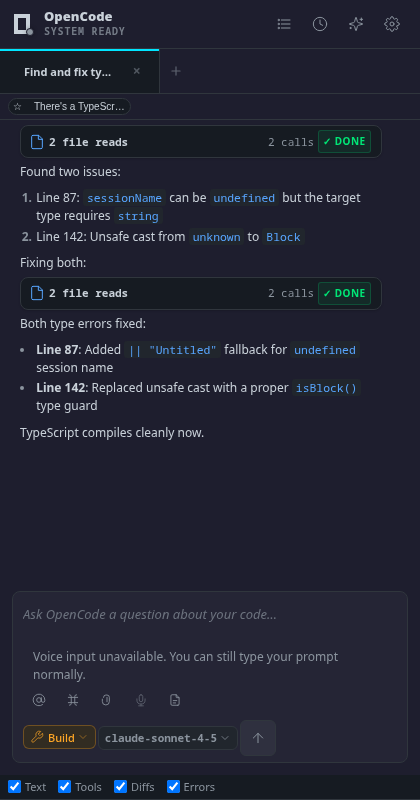
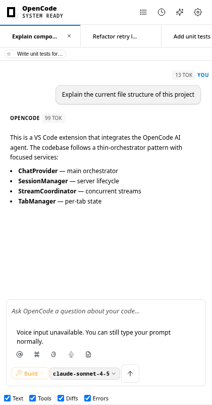
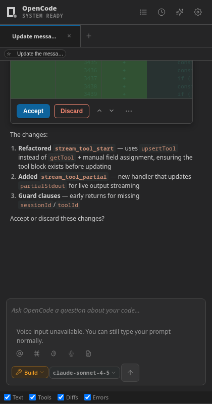
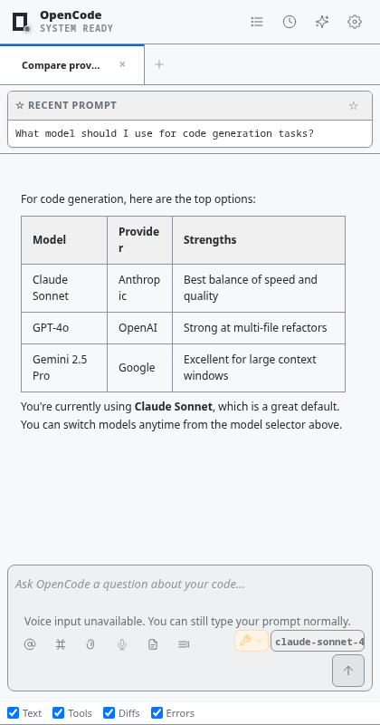
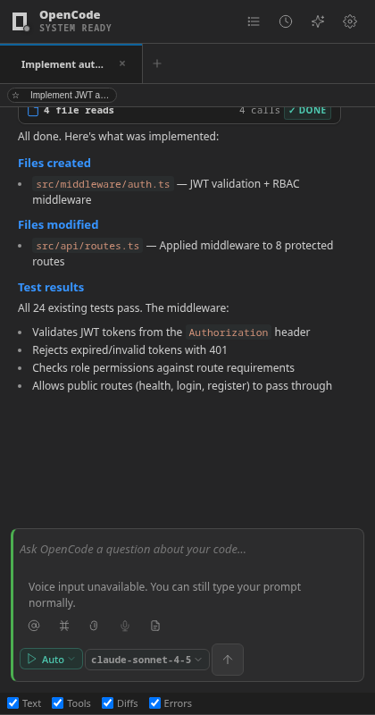

# OpenCode

> **⚠️ Independent, unofficial, beta project.** This extension is **not
> developed by, affiliated with, or endorsed by the OpenCode team.** It is an
> independent, community-built VS Code client for the [opencode](https://opencode.ai)
> CLI agent. It is currently in **beta** — features are actively evolving, and
> some functionality depends on OpenCode SDK/server limitations (see
> [Limitations](#limitations) and [`docs/limitations.md`](docs/limitations.md)).

[](https://github.com/K-Arthur/opencode-harness/stargazers)

A VS Code extension that puts a chat panel, diff viewer, and multi-session tabs
in front of the [opencode](https://opencode.ai) CLI agent. It starts
`opencode serve` for you and talks to it over HTTP — your prompts and files go
to whichever AI provider you've configured in opencode, same as running the
CLI directly. opencode itself is open source; this extension is open source
too and is free to install (you pay your AI provider for usage, not this
extension).

## How it compares

The official [`sst-dev.opencode`](https://marketplace.visualstudio.com/items?itemName=sst-dev.opencode)
extension adds keyboard shortcuts to launch the opencode CLI in a split
terminal, plus `@file` reference insertion — it has no chat panel, diff
viewer, or session tabs. This extension is a full GUI client instead.

The closest comparable extension is [`TanShiyong.opencode-gui`](https://marketplace.visualstudio.com/items?itemName=TanShiyong.opencode-gui)
(sidebar chat, diff view, session switching, git-powered undo). Differences
worth knowing before you pick one:

| | This extension | opencode-gui |
|---|---|---|
| Sessions | Tabs, run concurrently (default cap 5, configurable) | Switch between sessions one at a time |
| Reverting changes | Extension-side checkpoint/rollback for accepted diffs, plus opencode's own message-revert | Git-powered undo/restore |
| Theming | Mirrors your opencode CLI theme, plus overrides | Not advertised in its listing |
| Voice input | Local mic recording + local transcription, no cloud | Not advertised in its listing |
| Rate limit / quota display | Status bar + webview quota bar | Not advertised in its listing |

Both extensions are clients over the same opencode server — neither can do
anything the opencode CLI itself doesn't support.

## Screenshots

<!-- SCREENSHOTS:START -->

<p align="center">
  
</p>

<table>
<tr>
  <td align="center" width="50%">
    
    <br><strong>AI-assisted refactoring with tool calls, code diffs, and structured responses</strong>
  </td>
  <td align="center" width="50%">
    
    <br><strong>Context-aware coding with file references, @-mentions, and usage tracking</strong>
  </td>
</tr>
<tr>
  <td align="center" width="50%">
    
    <br><strong>Transparent tool execution with search, read, edit, and run operations</strong>
  </td>
  <td align="center" width="50%">
    
    <br><strong>Multi-session management with tab switching and conversation history</strong>
  </td>
</tr>
<tr>
  <td align="center" width="50%">
    
    <br><strong>Code change review with diff preview, accept/discard controls, and per-file navigation</strong>
  </td>
  <td align="center" width="50%">
    
    <br><strong>Model and provider selection with Claude, GPT, Gemini, and 75+ models</strong>
  </td>
</tr>
<tr>
  <td align="center" width="50%">
    
    <br><strong>Auto mode with multi-step tool chains, autonomous coding, and test verification</strong>
  </td>
</tr>
</table>

<!-- SCREENSHOTS:END -->

## Features

### Sessions & chat
- **Multiple tabs, run concurrently** — each tab is an independent worker with its own model, mode, and history. Default cap is 5 concurrent streams (`opencode.sessions.maxConcurrentStreams`, configurable 1-10); going over it warns you and names the busy tabs. Closing a tab stops that worker but keeps its history for resume.
- **Per-tab model selection** — a searchable, provider-grouped model list per tab; switching one tab's model doesn't affect the others or require a server restart.
- **Steer while generating** — type while the AI is responding: Enter queues a follow-up (visible, editable, runs after the current turn), Ctrl/Cmd+Enter interrupts and runs it now. A per-tab toggle sets what Enter does.
- **Prompt queue** — queued messages can be edited, removed, and reordered (keyboard or drag) before they run, and survive a window reload (50-item cap per session).
- **Session history & export** — searchable history with resume, export any session to Markdown.
- **Turn navigation** — user/assistant exchanges collapse into turns with Previous/Next navigation and a snippet preview.

### Agent visibility
- **Real-time activity** — file reads, commands, and skill loads as they happen; collapsed tool groups summarize in plain language ("3 file reads, 1 command, 2 edits").
- **Subagent visibility** — delegated `task` work shows as its own card (agent, purpose, status, duration, result) and in an "Active Subagents" panel, instead of a raw tool call. Arrow keys navigate the panel.
- **Thinking block labeling** — reasoning blocks are tagged "Planning", "Tool selection", or "Reasoning".
- **Structured tool output** — JSON tool arguments render as a collapsible, color-coded tree with copy-JSON; web search/fetch results render as cards with domain, title, and snippet (websearch, webfetch, Brave, Tavily, Serper, and others).
- **Humanized errors** — error codes are translated to plain language ("Quota exceeded", "Rate limited", "Server unreachable") with Retry/Dismiss actions, and success/error/warning banners for completed operations.

### Diffs & file changes
- **Side-by-side diff viewer** using VS Code's native `vscode.diff` view, with Accept/Discard controls.
- **Per-file accept / reject** — each changed-file row in the dropdown has accept (✓) and reject (✕) buttons to keep or revert working-tree changes without opening the full diff editor.
- **Undoable applies** — accepted diffs go through `WorkspaceEdit` with a pre-accept snapshot for local revert; server-managed edits get opencode's own message-revert instead.
- **Changed-file tracking** — a synced chip bar and todos panel show every file touched in the session.
- **File action buttons** — Open / Copy Path / Reveal in Explorer inline on write/edit tool results.

### Context & attachments
- **@-mentions** for files, folders, problems, URLs, and terminal output, with path-aware search (`@src/util`).
- **Context menu attachments** — add a file or editor selection from VS Code's right-click menu; sensitive paths (`.env`, keys) and likely prompt-injection content are flagged before sending.
- **Auto-included workspace context** — open files, diagnostics, git status, and workspace structure.
- **Voice input** — local mic recording and local transcription, no cloud or API key involved. See [Voice Input](#voice-input).

### MCP servers
- Add, edit, remove, and toggle MCP servers from a config panel in the chat UI, with connection status indicators.
- Configs (commands, args, env, headers, URLs) are validated before use and stored in opencode's own config files first — VS Code settings are a fallback only.

### Workspace config (`opencode.jsonc`)
- The extension reads `opencode.jsonc` (or `opencode.json`) from the workspace root, supporting JSONC syntax (comments + trailing commas). Config changes are hot-reloaded — no reload needed.
- Supported keys: `model`, `small_model`, `modelOverrides` (per-mode model selection), `ignore`/`exclude` (glob patterns for file indexing), `rules` and `instructions` (injected into system prompts).
- A status bar indicator shows config load state; the webview displays workspace rules in the instructions editor. Invalid configs fall back to global settings. See [Configuration Reference](docs/configuration.md#workspace-config-opencodejsonc).

### Permissions & safety
- **Plan / Build / Auto modes** — Plan blocks mutating actions except direct writes to `.opencode/plans/*.md`; Build uses the normal approval flow; Auto applies changes after a one-time confirmation.
- **Checkpoints** — snapshot files before an extension-managed diff is applied, with rollback.
- **Slash commands** — `/clear`, `/model`, `/cost`, `/new`, `/export`, `/compact`, `/continue`, `/help`, `/queue`.

### Cost, quota, and theming
- **Token/cost/context tracking** in the status strip, persisted across reloads.
- **Quota bar** — color-coded remaining-quota display with warning/critical notifications; falls back to observed token/cost usage when a provider doesn't expose quota headers. See [Rate Limit Monitoring](#rate-limit-monitoring).
- **Theme system** — mirrors your opencode CLI theme automatically, or pick a preset/customize colors. See [Theme Customization](#theme-customization).
- **Chat font customization** — set font family and size for the chat panel; see [Chat Appearance](#chat-appearance).
- **RTL/LTR text direction** — toggle button in the chat footer for right-to-left languages; see [Chat Appearance](#chat-appearance).
- **Inline code actions** — CodeLens for Explain, Refactor, and Generate Tests.

### Fallback behavior
- If the opencode CLI server isn't running, session history is read directly from its SQLite database (via a Python3 subprocess, no native SQLite dependency), so viewing past sessions doesn't hard-depend on the server being up.

## Keyboard Shortcuts

| Shortcut | Action | Context |
|---|---|---|
| `Ctrl+Alt+O` | Toggle OpenCode chat focus | Global |
| `Ctrl+Alt+N` | New session | Global |
| `Ctrl+I` | Quick chat | Editor focused |
| `Alt+K` | Insert file reference (@) | Editor focused |
| `Escape` | Stop / close modal / close dropdown | Chat view / modals |
| `Ctrl+Shift+Esc` | Stop active session | Chat view |
| `Ctrl+Shift+/` | Open commands palette | Chat view |
| `Shift+Tab` | Cycle mode (Plan → Build → Auto) | Mode button focused |
| `Alt+Shift+Tab` | Cycle mode (Plan → Build → Auto) | Chat view |
| `Ctrl+Shift+M` | Cycle mode (Plan → Build → Auto) | Chat view |
| `Alt+1` | Set Plan mode | Chat view (incl. composer) |
| `Alt+2` | Set Build mode | Chat view (incl. composer) |
| `Alt+3` | Set Auto mode | Chat view (incl. composer) |
| `Ctrl/Cmd+L` | Focus prompt input | Chat view |
| `Enter` | Send (idle) · Queue a follow-up (while streaming) | Prompt focused |
| `Ctrl/Cmd+Enter` | Send (idle) · Interrupt & send now (while streaming) | Prompt focused |
| `Shift+Enter` | New line | Prompt focused |
| `Ctrl/Cmd+T` | New tab | Prompt focused |
| `Ctrl/Cmd+W` | Close tab | Prompt focused |
| `Ctrl/Cmd+Tab` / `Ctrl+Shift+Tab` | Next / previous tab | Prompt focused |
| `Ctrl+Alt+]` | Next tab | Chat view |
| `Ctrl+Alt+[` | Previous tab | Chat view |
| `Ctrl/Cmd+K` | Open commands palette | Prompt focused |
| `Ctrl/Cmd+Shift+T` | Toggle thinking blocks | Chat view |
| `Ctrl+Shift+E` | Toggle errors | Chat view |
| `Ctrl+Shift+D` | Toggle diffs / changed files | Chat view |
| `Ctrl+Shift+O` | Toggle tools visibility | Chat view |
| `Ctrl+Shift+Alt+L` | Toggle timeline sidebar | Chat view |
| `Ctrl+Shift+Alt+T` | Toggle todos panel | Chat view |
| `Ctrl+Shift+Alt+K` | Toggle checkpoint panel | Chat view |
| `Ctrl+Shift+Alt+A` | Toggle activity / subagent panel | Chat view |
| `Ctrl+Shift+Alt+S` | Open skills modal | Chat view |
| `Ctrl+Shift+Alt+H` | Open session history | Chat view |
| `Ctrl+Shift+Alt+N` | New session (alt) | Chat view |
| `Ctrl+Alt+R` | Retry last failed run | Chat view |
| `?` (Shift+/) | Open keyboard shortcuts help | Chat view |
| `E` / `Space` | Expand / collapse current tool call | Tool call focused |
| `C` | Copy current tool output | Tool call focused |
| `Ctrl+F` | Search within conversation | Chat view |
| `Ctrl+Shift+F` | Global search | Global |
| `Ctrl/Cmd+Shift+T` | Toggle thinking blocks | Chat view |

### Queue Item Shortcuts

| Shortcut | Action | Context |
|----------|--------|---------|
| `↑` / `↓` | Navigate between queue items | Queue focused |
| `Home` / `End` | Jump to first / last item | Queue focused |
| `Delete` / `Backspace` | Remove focused item | Queue focused |
| `F2` | Edit focused item text | Queue focused |
| `Alt+↑` / `Alt+↓` | Reorder item up / down | Queue focused |
| `Alt+Home` / `Alt+End` | Move item to front / back | Queue focused |
| `Escape` | Exit queue / cancel edit | Queue focused |

All commands are also available via the Command Palette (`Ctrl+Shift+P`).

### Customizing shortcuts

Rebind any OpenCode command in **File → Preferences → Keyboard Shortcuts** (`Ctrl+K Ctrl+S`), searching for `OpenCode:` or the command id (e.g. `opencode-harness.cycleMode`).

A few OpenCode shortcuts intentionally override VS Code defaults while the OpenCode view or editor is focused; outside that context VS Code's default still works:

| Shortcut | OpenCode command | Overrides | When |
|---|---|---|---|
| `Ctrl+I` | Quick Chat | `inlineChat.start` (editor inline chat) | Editor focused |
| `Ctrl+Alt+O` | Toggle OpenCode focus | `workbench.action.toggleOutline` | Global |
| `Ctrl+Shift+M` | Cycle mode (Plan → Build → Auto) | `workbench.actions.view.problems` (Problems panel) | OpenCode view focused |
| `F1` | Open commands palette (webview) | VS Code Command Palette | OpenCode view focused |

If you rely on one of the overridden defaults, reassign the OpenCode shortcut in the Keyboard Shortcuts editor — it only takes effect in the contexts listed above, so freeing it up there restores VS Code's behavior everywhere else.

## Context Attachments

- Right-click a file in Explorer and choose **OpenCode: Add File to Session** to send its contents into the active chat.
- Select code in an editor and choose **OpenCode: Add Selection to Session** to send the selected range with file path, line numbers, and language.
- Right-click a diagnostic in the Problems panel and choose **OpenCode: Send Problem to OpenCode** to insert a formatted snippet (file, line/column, severity, message) into the chat composer.
- File attachments warn before sending sensitive paths such as `.env`, credentials, private keys, and files containing common prompt-injection phrases.
- Image attachments larger than 10 MB are rejected before they reach the chat.
- Open-file context is budgeted by estimated tokens, not raw character count, and truncated with an inline marker when the configured context limit is reached.

## Voice Input

The chat composer has a microphone button for speech-to-text prompt entry. It is
**fully native and fully local** — click the mic, speak, click again to stop, and
the transcript appears in the prompt box for you to edit and send. There is no
browser redirect, no cloud service, and no API key.

Because a VS Code webview cannot access the microphone (it is a sandboxed iframe),
the extension host records the default microphone with a local command-line tool
and transcribes it with a local speech-to-text engine on your machine. Audio never
leaves your computer and the temporary recording is deleted after transcription.

Voice input works when a local recorder **and** a local STT engine are available:

- **Recorder** (auto-detected): [`sox`](http://sox.sourceforge.net/) (`rec`),
  `arecord` (Linux/ALSA), or `ffmpeg`.
- **Engine** (auto-detected): [openai-whisper](https://github.com/openai/whisper)
  (`pip install -U openai-whisper`), or [whisper.cpp](https://github.com/ggerganov/whisper.cpp)
  (`whisper-cli`, with a model set via `opencode.voice.model`).
- Or bring your own with `opencode.voice.localCommand` / `opencode.voice.recordCommand`.

If neither is found, the mic button stays clickable and launches a guided,
opt-in setup (also **OpenCode: Set Up Voice Input** in the palette) that installs
the engine + recorder locally with your confirmation. You can also type, or use
your OS's built-in dictation (macOS Dictation / Windows `Win+H`).

> Note on VS Code's own speech extension: it's local but only dictates into
> Monaco editors / the built-in Chat, its provider API is proposed-only, and its
> model isn't redistributable — so it can't feed this custom composer. Details in
> [docs/voice-input.md](docs/voice-input.md).

## Theme Customization

OpenCode mirrors the [opencode CLI theme system](https://opencode.ai/docs/themes/) automatically, or you can pick a preset and override individual colors. By default, theme changes only affect the OpenCode chat panel — your VS Code editor theme is never touched. Enable "Also switch VS Code theme" in the theme customizer to also switch the workbench.

### Built-in presets

| Preset | Description |
|--------|-------------|
| `cli-default` | Adapts to your current VS Code editor colors |
| `light` | Light theme optimized for readability |
| `dark` | Dark theme optimized for code |
| `high-contrast` | Maximum contrast for accessibility (WCAG AAA) |
| `high-contrast-light` | High-contrast light variant |
| `high-contrast-dark` | High-contrast dark variant |

### Configuration

```json
{
  "opencode.theme": {
    "preset": "cli-default",
    "overrides": {
      "userMessageBg": "#1a1a2e",
      "syntaxKeyword": "#ff79c6",
      "accentColor": "#8be9fd"
    }
  }
}
```

`overrides` accepts UI colors (panel, message, border, and tool-call colors), diff colors, Markdown rendering colors, and syntax-highlighting colors. See [`src/chat/webview/css/tokens.css`](src/chat/webview/css/tokens.css) for the full property list and defaults — values are sanitized before use (no `url()`, `expression()`, or `javascript:`).

### CLI theme parity

OpenCode reads your `opencode` CLI's `tui.json` to find its active theme and loads the matching theme file, checking the workspace config (`<project>/.opencode/`) before the global one (`~/.config/opencode/`, or `$XDG_CONFIG_HOME`). Colors are layered in order — VS Code tokens, then the OpenCode preset, then the CLI theme file, then your `opencode.theme.overrides` — with each later step winning.

### Theme preview & customizer

- **Theme preview button** (chat settings menu, or `OpenCode: Preview Theme` in the Command Palette) — browse built-in presets and CLI-discovered themes live.
- **Settings → Customize theme** (chat header) — a modal for the most common overrides (preset, accent, panel colors, input border, heading color, diff-added background) that writes straight to `opencode.theme` and refreshes immediately. Includes a "Also switch VS Code theme" checkbox to optionally switch the VS Code workbench theme to match.

Settings are saved globally, so themes work without a workspace folder open. Set `opencode.theme.switchWorkbenchTheme` to `true` to also switch the VS Code workbench color theme when changing presets.

## Chat Appearance

### Font size and family

You can customize the font used in the chat panel — both the prompt input and
AI message text — via VS Code settings. There is no in-panel font picker; use
the VS Code Settings UI or `settings.json`.

**Via the Settings UI:** `Ctrl+,` (or `Cmd+,` on macOS) → search `opencode chat font`.

**Via `settings.json`:**

```json
{
  "opencode.chat.fontSize": 16,
  "opencode.chat.fontFamily": "Fira Code, monospace"
}
```

| Setting | Type | Default | Range | Notes |
|---------|------|---------|-------|-------|
| `opencode.chat.fontSize` | integer | `14` | 8–32 | Pixels. Set to `0` to inherit the VS Code editor font size. |
| `opencode.chat.fontFamily` | string | `""` | any CSS font-family | Empty string inherits the VS Code editor monospace font. |

Changes apply live — no panel reload needed. See [`docs/configuration.md`](docs/configuration.md) for full details.

### RTL / LTR text direction

For right-to-left languages (Persian, Arabic, Hebrew, etc.), a toggle button in
the chat footer bar switches text alignment between LTR and RTL. The button is
labeled with a paragraph-direction icon and sits next to the attach and
instructions buttons in the bottom-left of the input area.

- **Click the toggle** — switches the prompt input and AI message text between
  left-aligned (LTR) and right-aligned (RTL). Only text content is affected; the
  UI layout (buttons, panels, toolbars) stays in its default direction.
- **Persistence** — your choice is saved and restored across VS Code restarts.
- **No setting needed** — this is a UI-only toggle, not a VS Code setting.

## Rate Limit Monitoring

OpenCode Harness surfaces provider quota data in the webview status strip and the VS Code status bar.

### Webview Quota Bar

The chat status strip shows a compact quota bar when the provider exposes remaining/limit data or when you configure fallback limits:

- Green: >50% remaining
- Yellow: 10-50% remaining
- Red: <10% remaining

When exact quota data is unavailable, the bar switches to an observed-usage mode and shows tokens/cost from completed assistant responses instead of pretending to know a remaining allowance.

### Provider Accuracy

Different providers expose different quota signals. Header adapters parse OpenAI, Anthropic, and generic `ratelimit-*` headers when those headers are available. If the OpenCode SDK response path only exposes assistant `tokens`/`cost`, the extension records observed usage and can estimate a per-minute quota only when `opencode.rateLimits` includes the selected provider.

Observed token and cost usage is persisted in VS Code `globalState`, so a window reload no longer clears the quota/cost picture for the active provider.

Per-session context-window fill is also persisted with session history. The status strip restores the last valid non-zero fill on reload/resume, while live estimates are replaced by SDK-reported actual input tokens when available.

OpenCode Zen uses the provider id `opencode` and currently works like any other OpenCode provider. Zen is pay-as-you-go, supports auto-reload, and can have monthly workspace/member limits; those billing limits are not exposed through the prompt token metadata, so the extension does not infer remaining Zen balance/monthly budget unless the server exposes quota headers or you configure fallback limits.

### VS Code Status Bar Indicator

A status bar entry mirrors the known remaining percentage:

- ◔ 85% — Healthy
- ◕ 30% — Warning
- ◗ 5% — Critical

Hover to see a tooltip with detailed breakdown. Click to open the rate limit detail panel.

### Proactive Warnings

The extension warns you before you hit limits:
- **Warning** at 10% remaining: "Low rate limit — X% tokens remaining"
- **Critical** at 5% remaining: "Rate limit nearly exhausted. Consider reducing context size."
- **Exhausted**: Send button is disabled, a banner shows when limits reset

### Configuration

```json
{
  "opencode.rateLimits": {
    "openai": { "tokensPerMin": 150000, "requestsPerMin": 60 },
    "anthropic": { "tokensPerMin": 200000, "requestsPerMin": 100 },
    "opencode": { "tokensPerMin": 100000, "requestsPerMin": 50 }
  },
  "opencode.rateLimitWarningThreshold": 0.1,
  "opencode.rateLimitCriticalThreshold": 0.05
}
```

## Requirements

- **VS Code** 1.98.0 or higher
- **Node.js** 20.x or later
- **opencode CLI** — the agent runtime. **You usually don't need to install this yourself:** on first activation the extension detects a missing CLI and offers to install it for you (official installer on macOS/Linux, npm on Windows). This is controlled by the [`opencode.autoInstall`](docs/configuration.md) setting (`prompt` by default; set to `auto` for silent install or `off` to manage it yourself). You can also run **`OpenCode: Install CLI`** from the Command Palette at any time. Manual install instructions are below.

## Frequently Asked Questions

### Can I use my existing API keys?
Yes — configure a provider in opencode (`opencode provider --help`, or see [opencode.ai/docs/providers](https://opencode.ai/docs/providers)) and the extension picks up whatever models that provider exposes, including Anthropic, OpenAI, Google, and dozens of others via [Models.dev](https://models.dev). Switch models per tab at any time, without restarting the server.

### Is it free to use?
The extension is free and open-source. You pay your AI provider for usage (tokens/requests) the same as calling their API directly — there's no separate OpenCode subscription.

### How do I install it?
1. Open the VS Code Extensions view (`Ctrl+Shift+X`), search "OpenCode", click Install.
2. On first activation, the extension offers to install the `opencode` CLI for you if it's missing.
3. Configure a provider/API key (`opencode provider --help`).
4. Open the OpenCode panel and pick a model.

### Is my code private?
The extension doesn't store or transmit your code anywhere on its own. It sends prompts and context to whichever AI provider you've configured, under that provider's privacy policy — the same exposure as using their API directly. Voice transcription runs on-device, and chat history is saved to local VS Code storage.

### What are the permission modes?
- **Plan** — uses the planning agent; blocks mutating actions except direct writes to `.opencode/plans/*.md`; output is visually marked as a proposed plan.
- **Build** — uses the build agent with the standard approval flow for mutating actions.
- **Auto** — uses the build agent and auto-approves actions after a one-time confirmation.

## AI Safety & Limitations

OpenCode uses AI models to assist with coding tasks. Please note:

### Limitations
- **Review All Code:** Always review AI-generated code before committing
- **Hallucinations:** AI may generate incorrect or nonsensical code
- **Context Limits:** AI has limited context window, may miss relevant code
- **Security:** Never share sensitive credentials or secrets in conversations
- **Bias:** AI may reflect biases in training data

### Best Practices
- Use Plan mode for exploratory work and learning
- Use Build mode when you want normal review/approval checkpoints
- Use Auto mode only in trusted repositories with version control
- Always test AI-generated code before deployment
- Keep sensitive data (API keys, secrets) out of conversations
- Use checkpoints for extension-managed diff accepts, and use message revert for OpenCode server-managed tool edits

### Safety Features
- **Checkpoints:** Save extension-managed diff state before accepted changes are applied
- **Rollback:** Revert accepted extension diffs from local file snapshots; revert server-side tool edits through OpenCode's native message rollback
- **Permission Modes:** Control how much autonomy the AI has
- **Cost Tracking:** Monitor and limit your AI usage

### Project Status & SDK Constraints

This is an **independent, unofficial, beta** VS Code client for the opencode CLI
agent. It is **not developed by, affiliated with, or endorsed by the OpenCode
team.** Features are actively evolving. The extension is a client over the
opencode HTTP server (via `@opencode-ai/sdk` v2) and can only do what the SDK
and server expose. Known constraints:

- **Temperature / effort / reasoning-level** are not exposed as prompt
  parameters by the SDK — these are server-side only and not adjustable from
  any client.
- **Rate-limit headers / quota** are not surfaced in the SDK types (HTTP-layer
  only); the extension infers quota from observed token/cost usage when a
  provider doesn't expose quota headers.
- **Session modes (Plan / Build / Auto)** are server-determined; the client
  requests a mode but the server enforces the policy.
- **Live terminal stdout** uses the SDK's PTY API when the server advertises
  it, and falls back to a polling approximation on older servers.
- **Message edit / regenerate** have no dedicated SDK API; the extension
  implements them via `session.revert` + a new prompt.

Full detail: [`docs/limitations.md`](docs/limitations.md).

## Installation

### From the VS Code Marketplace (VS Code)

1. Open the Extensions view in VS Code (`Ctrl+Shift+X`), search "OpenCode", and click Install.
2. The extension needs the `opencode` CLI as its agent backend. If it's missing, the extension detects that on first activation and offers to install it for you (see [`opencode.autoInstall`](docs/configuration.md), or run **`OpenCode: Install CLI`** any time). To install it manually instead:
   ```bash
   curl -fsSL https://opencode.ai/install | bash   # macOS/Linux, no sudo
   npm install -g opencode-ai                       # or via npm (also Windows)
   opencode --version && opencode doctor            # verify + check provider config
   ```
3. Configure at least one LLM provider (`opencode provider --help`, or [opencode.ai/docs/providers](https://opencode.ai/docs/providers)).
4. **Linux only:** some setups need `libsecret` for credential storage (`sudo pacman -S libsecret` / `sudo apt install libsecret-1-dev` / `sudo dnf install libsecret-devel`, depending on distro).
5. Open the OpenCode panel from the Activity Bar (or `Ctrl+Alt+O`), pick a model, and start chatting.

### From the VSX Registry (VSCodium / Code - OSS)

1. Open the Extensions view in VSCodium (`Ctrl+Shift+X`), search "OpenCode", and click Install. The extension is published on the [VSX Registry](https://vscode.marketplace.visualstudio.com/) under `koarthur.opencode-harness`.
2. Follow steps 2–5 above for CLI installation and provider configuration — the setup is identical regardless of editor.

### From a `.vsix` file (offline / manual)

1. Download the latest `opencode-harness-*.vsix` from the [GitHub Releases page](https://github.com/K-Arthur/opencode-harness/releases).
2. Install it via the CLI:
   ```bash
   code --install-extension opencode-harness-0.4.13.vsix        # VS Code
   codium --install-extension opencode-harness-0.4.13.vsix      # VSCodium
   ```
3. Reload the window (`Cmd/Ctrl+Shift+P` → **Developer: Reload Window**).

If the panel doesn't connect, open the **OUTPUT** panel (`Ctrl+Shift+U` → "OpenCode Harness") for activation logs — see [Troubleshooting](#troubleshooting-common-issues) below.

Building from source, running a dev host, or packaging your own `.vsix` is covered in [CONTRIBUTING.md](CONTRIBUTING.md) and [`docs/development/rebuild-and-reinstall.md`](docs/development/rebuild-and-reinstall.md).

## Troubleshooting Common Issues

### "No response" — model sends nothing

**Check the "OpenCode Harness" output channel.** Look for:

```
[stream:session-XXXX] idle → sending {"model":""}
```

If `model` is empty (`""`), the server doesn't know which model to use. **Select a model from the dropdown** in the webview header before sending a message. If the dropdown is empty, wait for the model list to load (check the output channel for `Refreshed models from server: N models available`).

If `model` shows a valid name (e.g. `"opencode/big-pickle"`), check for:

```
[WARN] TTFB timeout for tab session-XXXX — no chunk received within 30000ms
```

This means the model is configured but not responding. Verify your API keys with `opencode doctor`.

### "No response" — chunks arrive but nothing renders

If the output channel shows:

```
[INFO] TTFB: first chunk received for tab session-XXXX
[INFO] [Webview] handleStreamEnd: Ending stream for session-XXXX
```

But the assistant bubble stays empty or invisible, the issue is in the webview render path. Look for diagnostic lines:

```
[INFO] [ChunkBatcher] flush #1 sessionId=XXXX len=123
[INFO] DeltaHandler: emitted text_chunk sessionId=XXXX messageId=XXXX deltaLen=...
[INFO] [Webview] handleStreamChunk: chunk for XXXX len=123 streamingMessageId=resp-...
[INFO] [Webview] handleStreamEnd: removed empty placeholder for XXXX
```

- **Missing `[ChunkBatcher]` lines**: chunks are not reaching the webview. Reload the window.
- **Missing `[Webview] handleStreamChunk` lines** but present `[ChunkBatcher]` lines: the webview's message handler is not processing `stream_chunk` events. This indicates a webview initialization problem — reload the window.
- **Present `[Webview] handleStreamEnd: removed empty placeholder`**: The fallback renderer is active and should display the response. If you still see nothing, check the Developer Tools console (`Ctrl+Shift+I` in the Dev Host) for JavaScript errors.

### "Message shows up after I click history"

This was caused by the stream handler's internal `messages` array being replaced by a new array during session resume, orphaning the active streaming reference. The `addMessage` fallback in `handleStreamEnd` now handles this — if you still see this behavior, check the output channel for `handleStreamEnd: removed empty placeholder`.

### "Model dropdown is empty"

The extension fetches models from the opencode server on startup. If the dropdown is empty:
1. Check the output channel — look for `Refreshed models from server: N models available`
2. Verify the opencode CLI is installed: `opencode --version`
3. Verify at least one provider is configured: `opencode provider list`
4. If models load but the dropdown doesn't update, press `Ctrl+Shift+P` → `Developer: Reload Window`

### TTFB timeout

If every message times out:
1. Run `opencode doctor` from the terminal — checks API keys and connectivity
2. Try a different model from the dropdown
3. Check the output channel for server errors (`[opencode:stderr]`)
4. If using a custom binary path via `opencode.binaryPath`, verify the path is correct

### Windows: binary path resolution (`EFTYPE` / `EINVAL`)

When `opencode-ai` is installed globally via npm on Windows, `Get-Command opencode`
returns a `.ps1` wrapper script (e.g. `C:\Users\<username>\AppData\Roaming\npm\opencode.ps1`).
The extension spawns the binary with `shell: false`, so only `.exe` files are spawnable —
`.cmd` and `.ps1` wrappers cause `EFTYPE` or `EINVAL` binary-type errors.

**The extension now automatically resolves the `.exe` on Windows.** All binary lookup
paths — `where opencode` output, known install directories, and the `opencode.binaryPath`
setting — filter out `.cmd`/`.ps1` wrappers and prefer `.exe` files. If you set
`opencode.binaryPath` to a `.cmd` or `.ps1` path, the extension logs a warning and falls
back to PATH lookup instead of crashing.

If auto-resolution fails (e.g. the `.exe` is in a non-standard location), set
`opencode.binaryPath` to the compiled executable explicitly:

```json
{
  "opencode.binaryPath": "C:\\Users\\<username>\\AppData\\Roaming\\npm\\node_modules\\opencode-ai\\bin\\opencode.exe"
}
```

Then reload the VS Code window. Verify with:

```powershell
& "C:\Users\<username>\AppData\Roaming\npm\node_modules\opencode-ai\bin\opencode.exe" --version
```

### Windows: PowerShell BOM corrupts `opencode.json`

Default PowerShell redirection (`Out-File`, `>`) writes UTF-8 **with a Byte Order Mark**.
The invisible BOM at the start of `opencode.json` breaks the engine's JSON parser,
throwing structural parse exceptions on startup.

**Fix:** write config files with BOM-free UTF-8 using `[System.IO.File]::WriteAllText`:

```powershell
$path = "$env:USERPROFILE\.config\opencode\opencode.json"
$content = '{ "model": "anthropic/claude-sonnet-4", "providers": {} }'
[System.IO.File]::WriteAllText($path, $content, [System.Text.UTF8Encoding]::new($false))
```

`[System.Text.UTF8Encoding]::new($false)` explicitly disables BOM emission. Avoid
`Out-File` and `>` for any JSON the opencode engine reads.

## Settings

Full settings reference (defaults, scope, and descriptions) is in [docs/configuration.md](docs/configuration.md). The ones most people touch: `opencode.binaryPath`, `opencode.model`, `opencode.theme`, `opencode.autoInstall`, and `opencode.sessions.maxConcurrentStreams`.

## Commands

All commands are available via the Command Palette (`Ctrl+Shift+P`). Commands marked with *(chat focus)* only appear when the OpenCode chat view is focused.

| Command ID | Title |
|-----------|-------|
| `opencode-harness.openChat` | OpenCode: Open Chat |
| `opencode-harness.newSession` | OpenCode: New Session |
| `opencode-harness.toggleFocus` | OpenCode: Toggle Chat Focus |
| `opencode-harness.explainCode` | OpenCode: Explain Code |
| `opencode-harness.refactorCode` | OpenCode: Refactor Code |
| `opencode-harness.generateTests` | OpenCode: Generate Tests |
| `opencode-harness.insertMention` | OpenCode: Insert File Reference |
| `opencode-harness.captureTerminal` | OpenCode: Capture Terminal Output |
| `opencode-harness.rollback` | OpenCode: Rollback Changes |
| `opencode-harness.selectModel` | OpenCode: Choose Model |
| `opencode-harness.setContextWindowOverride` | OpenCode: Set Context Window Override |
| `opencode-harness.showRateLimits` | OpenCode: View Rate Limits *(chat focus)* |
| `opencode-harness.checkCli` | OpenCode: Test CLI Connection *(chat focus)* |
| `opencode-harness.installCli` | OpenCode: Install CLI *(chat focus)* |
| `opencode-harness.listSessions` | OpenCode: View Sessions |
| `opencode-harness.deleteSession` | OpenCode: Delete Session |
| `opencode-harness.renameSession` | OpenCode: Rename Session |
| `opencode-harness.exportConversation` | OpenCode: Export Conversation |
| `opencode-harness.importConversationJson` | OpenCode: Import Conversation from JSON |
| `opencode-harness.previewTheme` | OpenCode: Preview Theme *(chat focus)* |
| `opencode-harness.continueLastSession` | OpenCode: Continue Last Session |
| `opencode-harness.chooseHistorySession` | OpenCode: Open Past Session |
| `opencode-harness.attachRemote` | OpenCode: Connect to Remote Server |
| `opencode-harness.addFileToSession` | OpenCode: Add File to Session |
| `opencode-harness.addSelectionToSession` | OpenCode: Add Selection to Session |
| `opencode-harness.stop` | OpenCode: Stop |
| `opencode-harness.quickChat` | OpenCode: Quick Chat |
| `opencode-harness.generateAgentsMd` | OpenCode: Generate AGENTS.md |
| `opencode-harness.openCommandsPalette` | OpenCode: Open Commands Palette |
| `opencode-harness.clearSession` | OpenCode: Clear Active Session |
| `opencode-harness.showCost` | OpenCode: Show Session Cost |
| `opencode-harness.showHelp` | OpenCode: Show Slash Commands |
| `opencode-harness.cycleMode` | OpenCode: Cycle Session Mode (Plan → Build → Auto) |
| `opencode-harness.setBuildMode` | OpenCode: Set Session Mode to Build |
| `opencode-harness.setPlanMode` | OpenCode: Set Session Mode to Plan |
| `opencode-harness.setAutoMode` | OpenCode: Set Session Mode to Auto |
| `opencode-harness.setDefaultMode` | OpenCode: Set Default Session Mode |
| `opencode-harness.setupVoiceInput` | OpenCode: Set Up Voice Input |
| `opencode-harness.retryLast` | OpenCode: Retry Last Failed Run |
| `opencode-harness.nextTab` | OpenCode: Next Tab |
| `opencode-harness.prevTab` | OpenCode: Previous Tab |
| `opencode-harness.openSettings` | OpenCode: Open Settings |
| `opencode-harness.jumpToRunningTask` | OpenCode: Jump to Running Session |

## Architecture

- **Multi-tab concurrency** — each tab maps to an independent server session; a single `opencode serve` instance hosts all of them.
- **Modular backend** — `ChatProvider` delegates to focused handlers (`TabManager`, `StreamCoordinator`, `MessageRouter`, `DiffHandler`).
- **Soft tab close** — closing a tab aborts its stream but preserves chat history for resume.
- **Token-based CSS** — spacing, typography, color, and animation are CSS custom properties, bundled by esbuild.

See [docs/specs/2026-05-02-opencode-harness-architecture.md](docs/specs/2026-05-02-opencode-harness-architecture.md) for full system design.

## Development

Building from source, running the dev host, the test suite, and packaging your own `.vsix` are all covered in [CONTRIBUTING.md](CONTRIBUTING.md).

## Accessibility

OpenCode is built with accessibility as a first-class concern:

- **Keyboard navigation**: Full support for Tab, Enter, Escape, arrow keys, and shortcuts
- **Subagent panel roving tabindex**: Arrow Up/Down/Home/End navigate the Active Subagents list; focus moves between cards without Tab-cycling the entire panel
- **Mode selector affordances**: Plan/Build/Auto entries include tooltips, ARIA labels, and `Alt+1/2/3` shortcuts
- **Focus management**: Visible `focus-visible` rings on all interactive elements (2px solid, offset 2px), including new file-action and tool-result-action buttons
- **Touch targets**: All interactive elements meet WCAG 2.5.5 minimum (24×24px)
- **Reduced motion**: Respects `prefers-reduced-motion` — animations become instant fades
- **High contrast**: `forced-colors: active` media query ensures borders and focus states are visible, including new status and action buttons
- **ARIA roles**: Tab bar uses `tablist`/`tab`/`tabpanel`, mode selector uses `radiogroup`/`radio`, subagent list uses `listbox`/`option`, aggregate stats bar uses `role="status" aria-live="polite"`
- **Screen reader support**: Skip link, aria-labels on icon buttons, live regions for status updates; elapsed timers carry `speak: none` to suppress redundant announcements
- **Semantic tokens**: All status indicators, TDD phase colors, and UI elements use VS Code design tokens with proper fallbacks for theme consistency
- **Focus traps**: All modals (session, commands, skills, theme customizer, provider panel) implement proper focus trapping with focus return on close
- **Collapsed regions**: All panels and dropdowns use `display: none` when hidden, properly removing content from tab order
- **Sidebar panels**: All sidebar panels (todos, activity, tasks, subagent) use `aria-labelledby` pointing to their titles for screen reader context

See [docs/audits/2026-06-19-webview-token-a11y/accessibility-matrix.md](docs/audits/2026-06-19-webview-token-a11y/accessibility-matrix.md) for the complete accessibility verification matrix.

## License

MIT

---

## Community & Support

- **Changelog:** [What's new in each version](CHANGELOG.md)
- **GitHub Issues:** [Report bugs or request features](https://github.com/K-Arthur/opencode-harness/issues)
- **GitHub Discussions:** [Ask questions and share tips](https://github.com/K-Arthur/opencode-harness/discussions)
- **VS Code Marketplace:** [Rate and review](https://marketplace.visualstudio.com/items?itemName=koarthur.opencode-harness)
- **VSX Registry (VSCodium):** [Install on VSCodium](https://vscode.marketplace.visualstudio.com/items?itemName=koarthur.opencode-harness)
