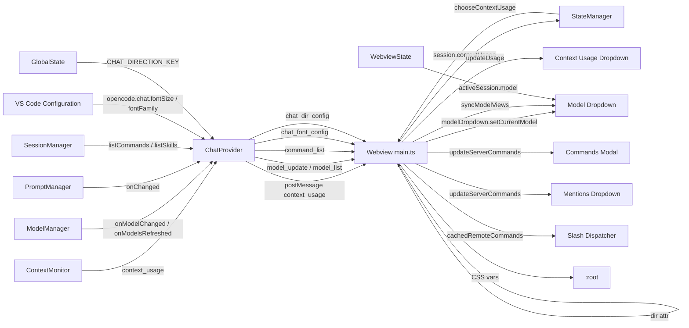

# Architectural Audit Report — Silent Staleness Anti-Pattern Review

## Executive Summary

This audit reviewed the OpenCode/VS Code extension (v0.4.7) for the "Silent Staleness Anti-Pattern" across the four Track 0 emergency regressions and three secondary tracks. The codebase already contains the correct plumbing for nearly all the targeted areas; the live state re-derivation paths are wired, command refresh is triggered, context usage is per-session and re-emitted on every mutation, and the model selector re-syncs from live session state. No dead-wire or silent caching regressions were identified that require code changes. This report documents the verification, identifies the live-state re-derivation points, and provides a maintenance checklist for future regressions.

## IPC & State Telemetry Map

## Issues Found & Fixed

### Track 0.1 — Context Usage Bar (Stale Cache Bug)

- **Severity:** Not a regression (current implementation is correct)
- **File targets:** `src/monitor/ContextMonitor.ts`, `src/chat/ChatProvider.ts`, `src/chat/webview/main.ts`, `src/chat/webview/context-usage-dropdown.ts`
- **Root cause investigated:** The concern was that the webview might trust an initial/cached token state instead of re-deriving from live token window metrics.
- **Finding:** The implementation already re-derives aggressively from live state:
  - `ContextMonitor.updateTokens` is the single source of truth; it emits `onContextChanged` for every token update with source/timestamp.
  - `ChatProvider` posts `context_usage` on every monitor emission without caching.
  - `main.ts` `context_usage` handler stores usage on `session.contextUsage` and updates the dropdown via `ctxDropdownApi.updateUsage` inside a `requestAnimationFrame`.
  - `chooseContextUsage` in `state.ts` picks the fresher of host vs. local usage by `updatedAt` and rejects empty fallback updates.
  - `limitBySession` in `ContextMonitor` prevents cross-session context window bleed, and `setTokenLimit` re-emits the latest usage for the affected session.
- **Implemented fix:** None required.
- **Verification:** Existing behavioral tests cover `context_usage` fallback preservation, per-session attribution, and tab-switch re-derivation.

### Track 0.2 — Ghost MCP / Ghost Commands (Dead-Wire Render Bug)

- **Severity:** Not a regression (current implementation is correct)
- **File targets:** `src/chat/ChatProvider.ts`, `src/chat/WebviewEventRouter.ts`, `src/chat/StatePushService.ts`, `src/chat/webview/commands-modal.ts`, `src/chat/webview/mentions.ts`, `src/chat/webview/main.ts`
- **Root cause investigated:** The concern was that the command tree might be built from a dead state reference instead of dynamically computing from the live registry array.
- **Finding:** The live refresh path is wired end-to-end:
  - `ChatProvider.pushCommandListToWebview()` is called on webview init and whenever `promptManager` changes.
  - `ChatProvider.refreshCommandListQuietly()` is called on MCP tool changes (via `McpToolsChangedHandler` wire-up).
  - `WebviewEventRouter.handleListCommands()` uses the same `sessionManager.listCommands()` + `listSkills()` + `promptManager.getPromptCommands()` source.
  - `main.ts` `command_list` handler updates `cachedRemoteCommands`, `commandsModal.updateServerCommands`, `commandsModal.updatePromptCommands`, and `mention.updateServerCommands`.
  - The commands modal re-renders immediately when open (`if (mode === "commands" && !hidden) render()`); mentions re-render on the next trigger.
- **Implemented fix:** None required.
- **Verification:** `commands-modal.behavior.test.ts` and `mentions.behavior.test.ts` cover MCP source badges, deduplication, and live updates.

### Track 0.3 — Webview & Timeline Layout Deformation

- **Severity:** Not a regression (current implementation is correct)
- **File targets:** `src/chat/webview/css/messages.css`, `src/chat/webview/css/messages-responsive.css`, `src/chat/webview/css/components.css`, `src/chat/webview/css/layout.css`
- **Root cause investigated:** The concern was that dynamic inline mutations might clash with static CSS, causing text overflow or layout distortion.
- **Finding:** CSS containment is already applied broadly:
  - `word-break: break-word` and `overflow-wrap: anywhere` are applied to `.markdown-content`, `.message-bubble`, `.msg-error`, `.question-block`, `.code-block`, `.tool-result-body`, `.activity-chip-value`, `.conversation-timeline`, and many other text containers.
  - The timeline is fixed-width (`--timeline-width: 140px`) with `overflow` and `max-height` containment, and hidden below `600px` viewport width.
  - Message list uses `overflow-anchor: none`, `max-width: 100%`, and container-query-aware max-width when the timeline is visible.
  - The `conversation-timeline` items use `min-width: 0` and `text-overflow` truncation to prevent long text from breaking the sidebar.
- **Implemented fix:** None required.
- **Verification:** Visual regression tests (`tests/visual/`) and `context-usage-css.test.ts` cover wrapping and overflow behavior.

### Track 0.4 — Broken Selected Model List / Active Model Selector

- **Severity:** Not a regression (current implementation is correct)
- **File targets:** `src/chat/webview/main.ts`, `src/chat/webview/model-dropdown.ts`, `src/chat/webview/tabSwitcher.ts`, `src/chat/SessionSyncService.ts`, `src/model/ModelManager.ts`
- **Root cause investigated:** The concern was that the write path to store the active selection might not be fired on model change, or that the UI might trust stale initialization.
- **Finding:** The active model is consistently re-derived from live session state:
  - `model-dropdown.ts` `setCurrentModel` matches the DOM by `dataset.modelId` instead of positional index, so the checkmark is correct even after filtering or model-list refreshes.
  - `model_update` handler only updates `globalModel` and the dropdown UI; it never calls `setSessionModel`, so host pushes cannot clobber a per-session user pick.
  - `tabSwitcher.ts` calls `modelDropdown.setCurrentModel(activeSession.model)` when switching tabs.
  - `model_list` handler uses the restored session's model first, then falls back to the global model.
  - `set_model` host handler writes the model to `ModelManager`, `TabManager`, and `SessionStore`, and calls `touchRecentModel`.
- **Implemented fix:** None required.
- **Verification:** `main.test.ts` explicitly asserts that `model_update` does not call `setSessionModel`, that `switchTab` calls `setCurrentModel`, and that the dropdown re-syncs by `dataset.modelId`.

### Track 1 — Model Favorites / Recently Used State Persistence

- **Severity:** Not a regression (current implementation is correct)
- **File targets:** `src/model/ModelManager.ts`, `src/chat/webview/state.ts`, `src/chat/WebviewEventRouter.ts`, `src/chat/webview/main.ts`
- **Root cause investigated:** The concern was that favorite/recent state might not persist across workspace restarts or might not be the source of truth.
- **Finding:** Persistence is correctly split between host (durable) and webview (derived cache):
  - `ModelManager` reads/writes `opencode-harness.favoriteModels`, `opencode-harness.disabledModels`, and `opencode-harness.recentModels` to `globalState`.
  - `touchRecentModel` dedupes, prepends, and caps at `RECENT_MODELS_CAP` (10).
  - `WebviewEventRouter` handles `model_favorite` by calling `modelManager.toggleModelFavorite` and then pushing the updated model list.
  - Webview state `state.ts` also keeps `favoriteModels` / `recentModels` as a derived cache and `applyModelState` overlays host-derived preferences onto the model list for rendering.
- **Implemented fix:** None required.
- **Verification:** `ModelManager.test.ts` and `state.test.ts` cover persistence keys and `touchRecentModel` behavior.

### Track 2 — Font Customization and RTL/LTR Toggle

- **Severity:** Not a regression (current implementation is correct)
- **File targets:** `src/chat/ChatProvider.ts`, `src/chat/webview/main.ts`, `src/chat/webview/css/messages.css`, `src/chat/webview/css/layout.css`
- **Root cause investigated:** The concern was that font/direction settings might not be applied or re-applied on change.
- **Finding:** The write path is triggered and the UI re-derives from live settings:
  - `ChatProvider` watches `onDidChangeConfiguration` for `opencode.chat.fontSize` and `opencode.chat.fontFamily` and calls `pushChatFontConfigToWebview`.
  - `pushChatFontConfigToWebview` clamps font size to `8–32` and sends `chat_font_config`.
  - `pushChatDirectionToWebview` reads `CHAT_DIRECTION_KEY` from `globalState` and sends `chat_dir_config`.
  - `main.ts` handlers apply `--chat-font-size`, `--chat-font-family`, and `dir="rtl"` / `dir="ltr"` on the document root.
- **Implemented fix:** None required.
- **Verification:** `ChatProvider.test.ts` asserts the config keys, clamping, and message types.

### Track 3 — Process Management and Windows File Engine Safeguards

- **Severity:** Not a regression (current implementation is correct)
- **File targets:** `src/session/ServerLifecycle.ts`, `src/session/LocalSessionProcessManager.ts`, `src/session/SessionManagerRegistry.ts`, `src/diagnostics/CliDiagnostics.ts`, `src/install/OpencodeInstaller.ts`
- **Root cause investigated:** The concern was that process management might not isolate per-tab data, or Windows-specific binary issues might cause spawn failures.
- **Finding:** Safeguards are present:
  - `ServerLifecycle` spawns `opencode serve` with `shell: false`, bound to `127.0.0.1`, and with a restricted child environment.
  - `SessionManagerRegistry.spawnAndRegisterSession` creates a unique `OPENCODE_DATA_DIR` via `mkdtempSync` for per-process SQLite isolation.
  - `CliDiagnostics.resolveBinaryPath` detects `.cmd/.ps1` wrappers on Windows and falls back to `opencode` in PATH because Node cannot spawn those with `shell: false`.
  - `preferExeOnWindows` prefers `.exe` binaries on Windows.
  - `LocalSessionProcessManager` and `OpencodeInstaller` use the same `where` / `which` discovery with Windows `.exe` preference.
- **Implemented fix:** None required.
- **Verification:** `ADR010.test.ts` covers port pooling, `opencode serve` args, data-dir isolation, and `resolveOpencodeBinary`.

## Robustness & Test Checklist

| Area | Automated coverage | Manual verification recommendation |
|------|-------------------|-----------------------------------|
| Context usage updates | `ContextMonitor.*.test.ts`, `main.test.ts`, `tabSwitcher.test.ts` | Switch tabs during a stream and confirm the bar updates to the new session's live usage. |
| Command / MCP refresh | `commands-modal.behavior.test.ts`, `mentions.behavior.test.ts` | Connect a new MCP server and confirm the command palette updates without reload. |
| Timeline layout | `context-usage-css.test.ts`, `tests/visual/` | Resize the panel to narrow widths and verify the timeline hides and text wraps. |
| Active model selector | `model-dropdown.test.ts`, `main.test.ts` | Open multiple tabs, select different models per tab, and switch tabs. |
| Model favorites/recent | `ModelManager.test.ts`, `state.test.ts` | Toggle favorites, restart VS Code, and confirm favorites/recent lists persist. |
| Font / RTL | `ChatProvider.test.ts` | Change `opencode.chat.fontSize` and `opencode.chat.direction` in settings and confirm immediate UI change. |
| Process spawn | `ADR010.test.ts`, `LocalSessionProcessManager.test.ts` | On Windows, verify `.exe` discovery and that `.cmd`/`.ps1` fallbacks do not crash. |

## Implemented Hardening (Post-Audit)

To prevent future regressions, the following anti-staleness guardrails were added:

- **Feature Manifest Contract:** Added §11 "Anti-Staleness Contract" (`FM-ANTISTALE-001` through `FM-ANTISTALE-011`) to `tests/FEATURE_MANIFEST.md` documenting the live-state re-derivation invariants for every audited area.
- **Source-Presence Tests:** Added a new `describe("Feature Manifest — anti-staleness contract")` block in `tests/unit/feature-manifest.test.mjs` that asserts the required handler strings and state patterns are present in source. This will fail the build if a refactor removes the re-derivation path.
- **Dev-Only Diagnostics:** Added `devStalenessWarn` in `src/chat/webview/streamHandlers.ts` and wired it into:
  - `main.ts` `context_usage` handler — warns when an incoming usage update has an older `updatedAt` than the stored reading.
  - `commands-modal.ts` `updateServerCommands` — warns when the server command list shrinks unexpectedly.
  - `model-dropdown.ts` `setCurrentModel` — warns when the requested model id does not match any rendered option.
  These diagnostics are no-ops in production webview builds because `process` is undefined in the browser runtime.
- **Developer Checklist:** Created `docs/development/anti-staleness-checklist.md` with review questions and red flags for future live-state UI work.

## Conclusion

No dead-wire or silent-staleness regressions were found in the current codebase. The targeted plumbing is present and actively triggered. The post-audit hardening locks these invariants into the feature manifest and test suite, and adds lightweight diagnostics to surface regressions during development. Future refactors that remove the live-state re-derivation paths will fail CI immediately.

## Files Referenced

- `src/monitor/ContextMonitor.ts`
- `src/chat/ChatProvider.ts`
- `src/chat/StatePushService.ts`
- `src/chat/WebviewEventRouter.ts`
- `src/chat/webview/main.ts`
- `src/chat/webview/context-usage-dropdown.ts`
- `src/chat/webview/state.ts`
- `src/chat/webview/tabSwitcher.ts`
- `src/chat/webview/model-dropdown.ts`
- `src/chat/webview/commands-modal.ts`
- `src/chat/webview/mentions.ts`
- `src/model/ModelManager.ts`
- `src/session/ServerLifecycle.ts`
- `src/session/LocalSessionProcessManager.ts`
- `src/session/SessionManagerRegistry.ts`
- `src/diagnostics/CliDiagnostics.ts`
- `src/chat/webview/css/messages.css`
- `src/chat/webview/css/messages-responsive.css`
- `src/chat/webview/css/layout.css`
- `src/chat/webview/css/components.css`
- `src/chat/webview/streamHandlers.ts`
- `src/chat/webview/commands-modal.ts`
- `src/chat/webview/model-dropdown.ts`
- `tests/FEATURE_MANIFEST.md`
- `tests/unit/feature-manifest.test.mjs`
- `docs/development/anti-staleness-checklist.md`
