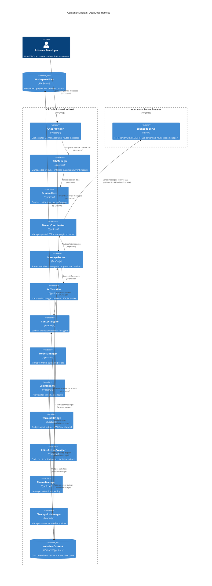

<!-- Auto-generated from architecture spec -->
# Container Diagram — OpenCode Harness

```mermaid
C4Container
    title Container Diagram: OpenCode Harness

    Person(developer, "Software Developer", "Uses VS Code to write code with AI assistance")

    System_Boundary(vscode_host, "VS Code Extension Host") {
        Container(chat_provider, "Chat Provider", "TypeScript", "Orchestrates UI, manages tabs, routes messages")
        Container(tab_manager, "TabManager", "TypeScript", "Manages tab lifecycle, enforces max 3 concurrent streams")
        Container(session_store, "SessionStore", "TypeScript", "Persists chat history per tab/session")
        Container(stream_coordinator, "StreamCoordinator", "TypeScript", "Manages per-tab SSE streaming from server")
        Container(message_router, "MessageRouter", "TypeScript", "Routes webview messages to appropriate handlers")
        Container(diff_handler, "DiffHandler", "TypeScript", "Tracks code changes, presents diffs for review")
        Container(context_engine, "ContextEngine", "TypeScript", "Gathers workspace context for agent")
        Container(model_manager, "ModelManager", "TypeScript", "Manages model selection per tab")
        Container(skill_manager, "SkillManager", "TypeScript", "Tree view for skill enable/disable")
        Container(terminal_bridge, "TerminalBridge", "TypeScript", "Bridges agent output to VS Code channel")
        Container(inline_actions, "InlineActionProvider", "TypeScript", "CodeLens + context menus for inline actions")
        Container(theme_manager, "ThemeManager", "TypeScript", "Manages extension theming")
        Container(checkpoint_manager, "CheckpointManager", "TypeScript", "Manages conversation checkpoints")

        ContainerDb(webview, "WebviewContent", "HTML/CSS/TypeScript", "Chat UI rendered in VS Code webview panel")
    }

    System_Boundary(opencode_server_host, "opencode Server Process") {
        Container(api, "opencode serve", "Node.js", "HTTP server with REST API + SSE streaming, multi-session support")
    }

    ContainerDb(workspace, "Workspace Files", "File System", "Developer's project files and source code")

    Rel(developer, chat_provider, "Opens chat, sends messages", "VS Code UI")
    Rel(chat_provider, tab_manager, "Requests new tab / switch tab", "in-process")
    Rel(chat_provider, message_router, "Forwards webview messages", "in-process")
    Rel(tab_manager, session_store, "Persists session data", "in-process")
    Rel(message_router, stream_coordinator, "Routes chat messages", "in-process")
    Rel(message_router, diff_handler, "Routes diff requests", "in-process")
    Rel(message_router, context_engine, "Requests context", "in-process")
    Rel(stream_coordinator, api, "Sends messages, receives SSE", "HTTP REST + SSE @ localhost:4096")
    Rel(diff_handler, webview, "Presents diffs", "webview message")
    Rel(webview, message_router, "Sends user messages", "webview message")
    Rel(context_engine, workspace, "Reads workspace files", "VS Code API")
    Rel(inline_actions, context_engine, "Requests context for actions", "in-process")
    Rel(terminal_bridge, webview, "Receives agent output", "webview message")
    Rel(skill_manager, webview, "Updates skill state", "webview message")
    Rel(model_manager, webview, "Updates model display", "webview message")
```
