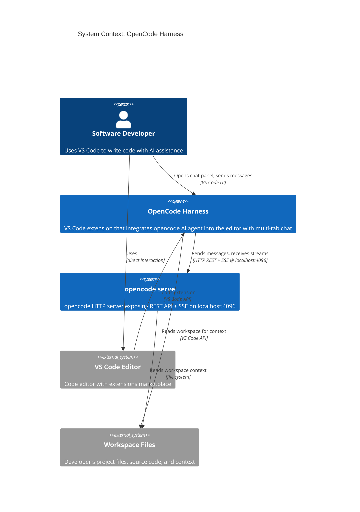

<!-- Auto-generated from architecture spec -->
# System Context Diagram

```mermaid
C4Context
  title System Context: OpenCode Harness

  Person(developer, "Software Developer", "Uses VS Code to write code with AI assistance")

  System(opencode_harness, "OpenCode Harness", "VS Code extension that integrates opencode AI agent into the editor with multi-tab chat")

  System(opencode_server, "opencode serve", "opencode HTTP server exposing REST API + SSE on localhost:4096")

  System_Ext(vscode, "VS Code Editor", "Code editor with extensions marketplace")
  System_Ext(workspace, "Workspace Files", "Developer's project files, source code, and context")

  Rel(developer, vscode, "Uses", "direct interaction")
  Rel(vscode, opencode_harness, "Loads extension", "VS Code API")
  Rel(developer, opencode_harness, "Opens chat panel, sends messages", "VS Code UI")
  Rel(opencode_harness, opencode_server, "Sends messages, receives streams", "HTTP REST + SSE @ localhost:4096")
  Rel(opencode_server, workspace, "Reads workspace context", "file system")
  Rel(opencode_harness, workspace, "Reads workspace for context", "VS Code API")
```
