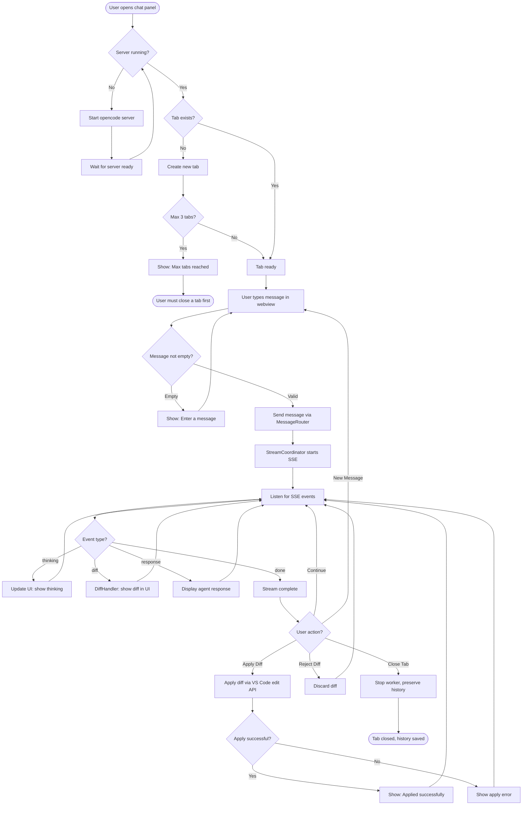

<!-- Auto-generated from architecture spec -->
# Flow: UC-01: Send Chat Message and Review Diff

```mermaid
flowchart TD
    Start([User opens chat panel])
    
    Start --> CheckServer{Server running?}
    
    CheckServer -->|No| StartServer[Start opencode server]
    StartServer --> WaitServer[Wait for server ready]
    WaitServer --> CheckServer
    
    CheckServer -->|Yes| CheckTab{Tab exists?}
    
    CheckTab -->|No| CreateTab[Create new tab]
    CreateTab --> CheckConcurrency{Max 3 tabs?}
    CheckConcurrency -->|Yes| ShowWarning[Show: Max tabs reached]
    ShowWarning --> End2([User must close a tab first])
    CheckConcurrency -->|No| TabReady[Tab ready]
    
    CheckTab -->|Yes| TabReady
    
    TabReady --> UserInput[User types message in webview]
    UserInput --> ValidateInput{Message not empty?}
    
    ValidateInput -->|Empty| ShowError[Show: Enter a message]
    ShowError --> UserInput
    
    ValidateInput -->|Valid| SendMessage[Send message via MessageRouter]
    SendMessage --> StartStream[StreamCoordinator starts SSE]
    
    StartStream --> StreamEvents[Listen for SSE events]
    
    StreamEvents --> CheckEventType{Event type?}
    
    CheckEventType -->|thinking| UpdateUI1[Update UI: show thinking]
    UpdateUI1 --> StreamEvents
    
    CheckEventType -->|diff| ShowDiff[DiffHandler: show diff in UI]
    ShowDiff --> StreamEvents
    
    CheckEventType -->|response| ShowResponse[Display agent response]
    ShowResponse --> StreamEvents
    
    CheckEventType -->|done| Complete[Stream complete]
    
    Complete --> UserAction{User action?}
    
    UserAction -->|Apply Diff| ApplyDiff[Apply diff via VS Code edit API]
    ApplyDiff --> CheckApply{Apply successful?}
    CheckApply -->|Yes| Success[Show: Applied successfully]
    Success --> StreamEvents
    CheckApply -->|No| ShowApplyError[Show apply error]
    ShowApplyError --> StreamEvents
    
    UserAction -->|Reject Diff| RejectDiff[Discard diff]
    RejectDiff --> StreamEvents
    
    UserAction -->|Continue| StreamEvents
    
    UserAction -->|New Message| UserInput
    
    UserAction -->|Close Tab| SoftClose[Stop worker, preserve history]
    SoftClose --> End([Tab closed, history saved])
```
