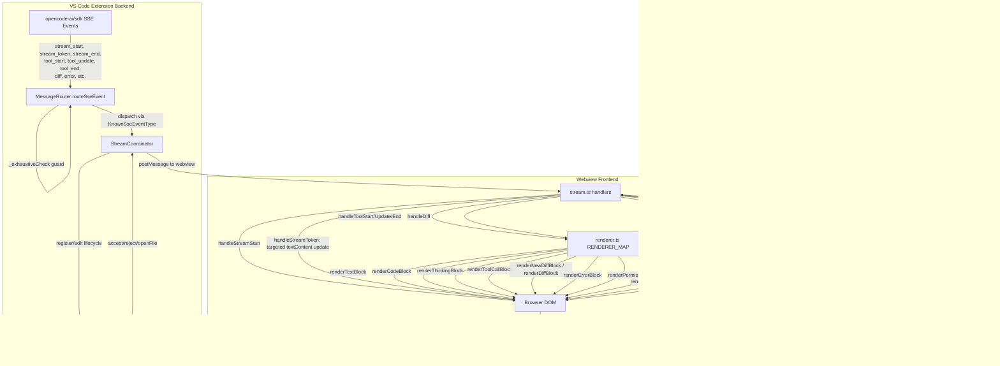

# Rendering Pipeline



## Key Data Flow

1. **SSE Event → MessageRouter**: `routeSseEvent()` receives raw events from the opencode server. A `switch` on `KnownSseEventType` dispatches each type. The `_exhaustiveCheck(never)` guard catches compile-time if a type is missing.

2. **MessageRouter → StreamCoordinator**: Events are forwarded via `postMessage` to the webview. StreamCoordinator manages per-tab lifecycle (watchdog, buffer, completion timeout).

3. **StreamCoordinator → Webview**: `postMessage()` calls hit `stream.ts` handlers in the webview. Each handler type has a dedicated function.

4. **stream.ts → DOM**: `handleStreamToken` does targeted `textContent` updates (no full re-render). All other handlers call `renderBlock()` from `renderer.ts`.

5. **renderer.ts → DOM**: The `RENDERER_MAP` dispatch table maps `block.type` to a renderer function. Each renderer returns an `HTMLElement` with ARIA attributes, sanitized content, and event listeners.

6. **DOM → DiffHandler**: Click events on accept/discard/open buttons post messages back to the extension backend. DiffHandler applies the edit and emits status updates via `emitToWebview`.

## State Flow

```
Streaming IDLE → stream_start → STREAMING
STREAMING → stream_token → STREAMING (targeted textContent update)
STREAMING → tool_start → STREAMING (pending tool call appended)
STREAMING → tool_update → STREAMING (tool call state updated)
STREAMING → tool_end → STREAMING (tool call → result state)
STREAMING → diff → STREAMING (diff block appended)
STREAMING → stream_end → IDLE (cursor removed, blocks finalized)
STREAMING → stream_error → IDLE (placeholder removed, error block shown)
STREAMING → abort → IDLE (stream:end with reason:aborted)
```
