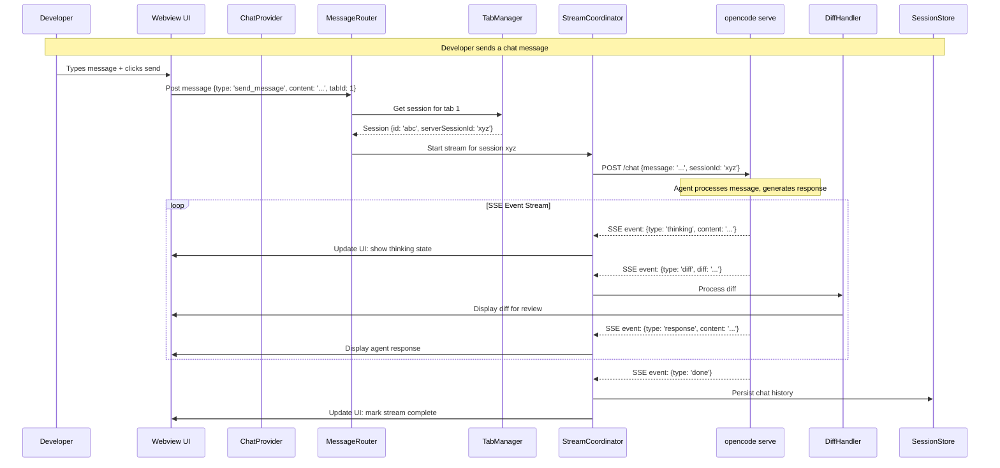

<!-- Auto-generated from architecture spec -->
# Sequence Diagram: Primary Flow (Send Chat Message)

```mermaid
sequenceDiagram
    participant User as Developer
    participant Webview as Webview UI
    participant ChatProvider as ChatProvider
    participant MessageRouter as MessageRouter
    participant TabManager as TabManager
    participant StreamCoordinator as StreamCoordinator
    participant API as opencode serve
    participant DiffHandler as DiffHandler
    participant SessionStore as SessionStore

    Note over User,SessionStore: Developer sends a chat message

    User->>Webview: Types message + clicks send
    Webview->>MessageRouter: Post message {type: 'send_message', content: '...', tabId: 1}
    
    MessageRouter->>TabManager: Get session for tab 1
    TabManager-->>MessageRouter: Session {id: 'abc', serverSessionId: 'xyz'}
    
    MessageRouter->>StreamCoordinator: Start stream for session xyz
    StreamCoordinator->>API: POST /chat {message: '...', sessionId: 'xyz'}
    
    Note over API: Agent processes message, generates response

    loop SSE Event Stream
        API-->>StreamCoordinator: SSE event: {type: 'thinking', content: '...'}
        StreamCoordinator->>Webview: Update UI: show thinking state
        
        API-->>StreamCoordinator: SSE event: {type: 'diff', diff: '...'}
        StreamCoordinator->>DiffHandler: Process diff
        DiffHandler->>Webview: Display diff for review
        
        API-->>StreamCoordinator: SSE event: {type: 'response', content: '...'}
        StreamCoordinator->>Webview: Display agent response
    end

    API-->>StreamCoordinator: SSE event: {type: 'done'}
    StreamCoordinator->>SessionStore: Persist chat history
    StreamCoordinator->>Webview: Update UI: mark stream complete
```
