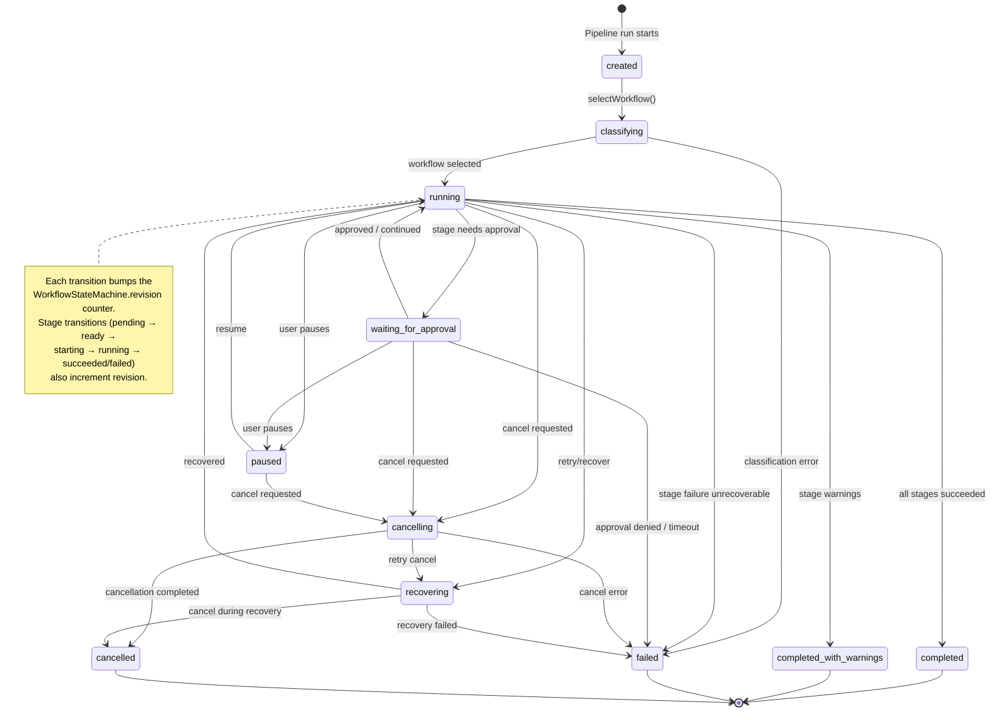

<!-- Auto-generated from architecture spec -->
# State Machine: Orchestrated Workflow

```mermaid
stateDiagram-v2
    [*] --> created: Pipeline run starts

    created --> classifying: selectWorkflow()
    classifying --> running: workflow selected
    classifying --> failed: classification error

    running --> waiting_for_approval: stage needs approval
    running --> paused: user pauses
    running --> cancelling: cancel requested
    running --> recovering: retry/recover
    running --> completed: all stages succeeded
    running --> completed_with_warnings: stage warnings
    running --> failed: stage failure unrecoverable

    waiting_for_approval --> running: approved / continued
    waiting_for_approval --> paused: user pauses
    waiting_for_approval --> cancelling: cancel requested
    waiting_for_approval --> failed: approval denied / timeout

    paused --> running: resume
    paused --> cancelling: cancel requested

    cancelling --> cancelled: cancellation completed
    cancelling --> failed: cancel error
    cancelling --> recovering: retry cancel

    recovering --> running: recovered
    recovering --> failed: recovery failed
    recovering --> cancelled: cancel during recovery

    completed --> [*]
    completed_with_warnings --> [*]
    failed --> [*]
    cancelled --> [*]

    note right of running
        Each transition bumps the
        WorkflowStateMachine.revision counter.
        Stage transitions (pending → ready →
        starting → running → succeeded/failed)
        also increment revision.
    end note
```
