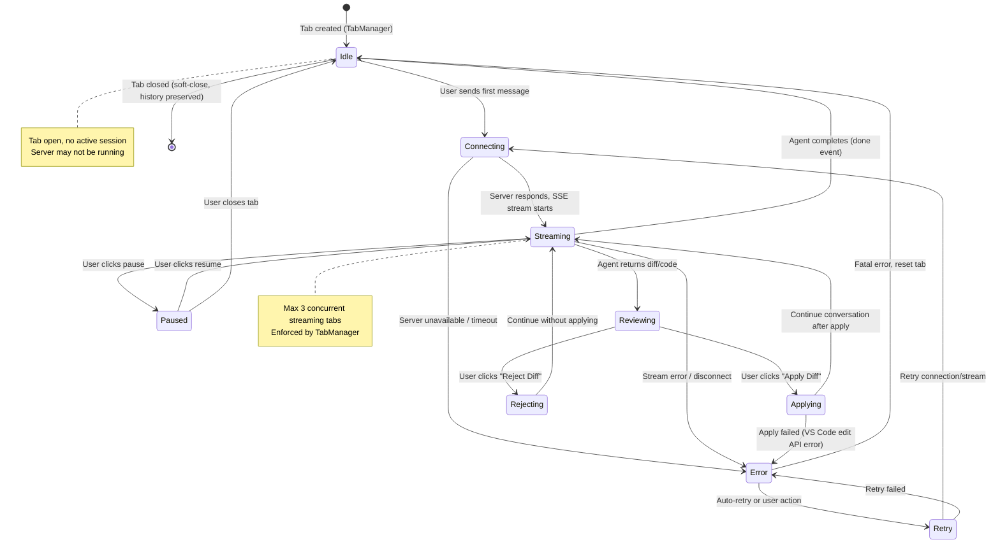

<!-- Auto-generated from architecture spec -->
# State Machine: Chat Tab / Session Lifecycle

```mermaid
stateDiagram-v2
    [*] --> Idle: Tab created (TabManager)

    Idle --> Connecting: User sends first message
    note right of Idle
        Tab open, no active session
        Server may not be running
    end note

    Connecting --> Streaming: Server responds, SSE stream starts
    Connecting --> Error: Server unavailable / timeout

    Streaming --> Paused: User clicks pause
    Streaming --> Reviewing: Agent returns diff/code
    Streaming --> Idle: Agent completes (done event)
    Streaming --> Error: Stream error / disconnect

    Reviewing --> Applying: User clicks "Apply Diff"
    Reviewing --> Rejecting: User clicks "Reject Diff"
    
    Applying --> Streaming: Continue conversation after apply
    Applying --> Error: Apply failed (VS Code edit API error)
    
    Rejecting --> Streaming: Continue without applying
    
    Paused --> Streaming: User clicks resume
    Paused --> Idle: User closes tab

    Error --> Retry: Auto-retry or user action
    Error --> Idle: Fatal error, reset tab
    
    Retry --> Connecting: Retry connection/stream
    Retry --> Error: Retry failed

    Idle --> [*]: Tab closed (soft-close, history preserved)
    
    note right of Streaming
        Max 3 concurrent streaming tabs
        Enforced by TabManager
    end note
```
